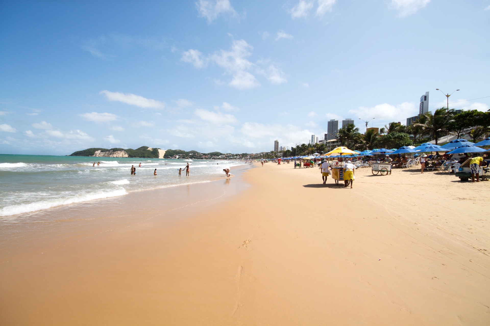

# Explorando as Maravilhas Naturais do Nordeste Brasileiro

Feito por Reinan Gabriel

---

# Introdução

Nesta apresentação, vamos mergulhar nas belezas naturais do Nordeste brasileiro. Conheceremos suas praias paradisíacas, formações rochosas impressionantes e rica biodiversidade. Prepare-se para se encantar com as maravilhas que essa região tem a oferecer!

---

# Praias Deslumbrantes

Descubra as praias deslumbrantes do Nordeste brasileiro, como a Praia dos Carneiros, com suas águas cristalinas e coqueiros. Conheça também a Praia de Pipa, famosa por suas falésias coloridas e piscinas naturais. Essas praias são verdadeiros paraísos tropicais!

---

# Formações Rochosas

Explore as formações rochosas impressionantes do Nordeste, como os famosos Ponta dos Mangues e a Pedra Furada. Essas formações naturais são verdadeiras obras de arte da natureza e proporcionam vistas deslumbrantes. Não deixe de conhecer esses tesouros geológicos!

---

# Cânions e Cachoeiras

Maravilhe-se com os cânions e cachoeiras exuberantes do Nordeste brasileiro. Conheça o Cânion do Xingó, com sua imponente paisagem de paredões rochosos e águas verde-esmeralda. Explore também a Cachoeira da Fumaça, uma queda d'água imponente em meio à natureza preservada.

---

# Biodiversidade Rica

Descubra a rica biodiversidade do Nordeste brasileiro. Essa região abriga uma grande variedade de espécies, como a arara-azul-de-lear, o mico-leão-dourado e a tartaruga marinha. Conheça os esforços de conservação e os ecossistemas únicos que tornam essa região tão especial.

---

# Sabores do Nordeste

Além das belezas naturais, o Nordeste brasileiro também é conhecido por sua rica gastronomia. Delicie-se com pratos típicos como acarajé, tapioca, moqueca de peixe e muito mais. A culinária nordestina é uma verdadeira festa para o paladar!

---

# Artesanato e Cultura

Conheça o rico artesanato e a cultura local do Nordeste brasileiro. Descubra as rendas de bilro, as cerâmicas de Caruaru e os bordados de Juazeiro do Norte. Essas tradições artísticas refletem a história e a identidade dessa região encantadora.

--- 

# Conclusão

Nesta apresentação, exploramos as maravilhas naturais do Nordeste brasileiro, desde suas praias paradisíacas até sua rica biodiversidade. Conhecer essa região é se encantar com sua beleza única e se conectar com a natureza. Não perca a oportunidade de visitar o Nordeste e vivenciar todas essas maravilhas!

---

# Obrigado!

Essa foi uma apresentação de exemplo para aprender a utilizar a ferramenta do Marp.